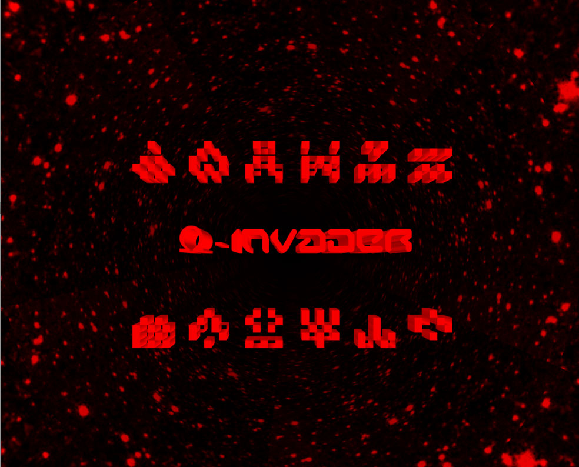
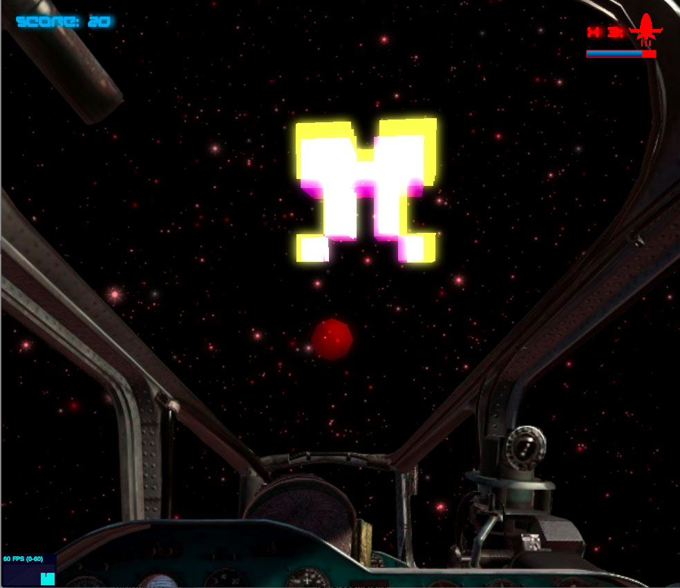

ds.fracVaders
(DemoScene).fracVaders
=============
<pre>
   ___                             _____                     _               
  /___\_ __ ___   ___  __ _  __ _  \_   \_ ____   ____ _  __| | ___ _ __ ___ 
 //  // '_ ` _ \ / _ \/ _` |/ _` |  / /\/ '_ \ \ / / _` |/ _` |/ _ \ '__/ __|
/ \_//| | | | | |  __/ (_| | (_| /\/ /_ | | | \ V / (_| | (_| |  __/ |  \__ \
\___/ |_| |_| |_|\___|\__, |\__,_\____/ |_| |_|\_/ \__,_|\__,_|\___|_|  |___/
                      |___/                                                   
                                                                                                                                                                                                                                                     
</pre>

	
Simple game that uses an algorithm to create random fractals in 3d space.  This game borrows jared tarbell http://levitated.net/daily/levInvaderFractal.html and renders the fractals as voxels.  This is a work in progress.
	 

